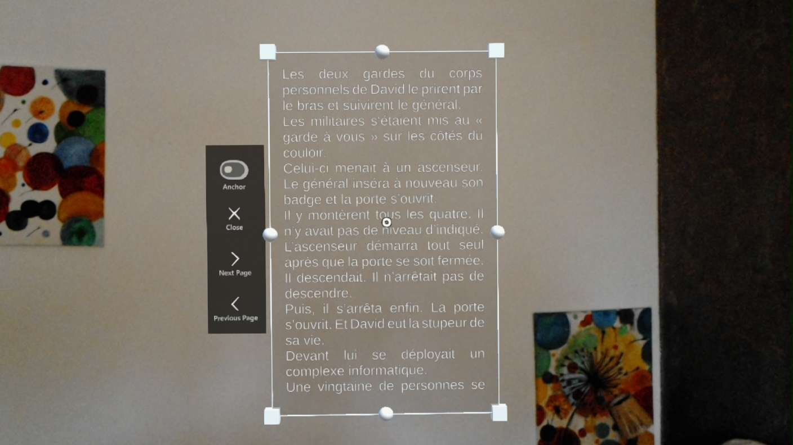
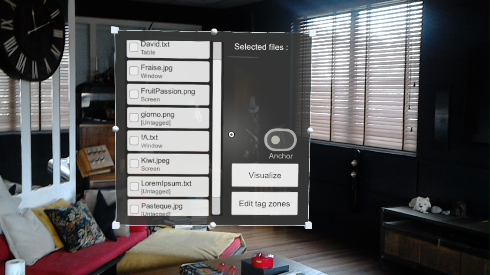
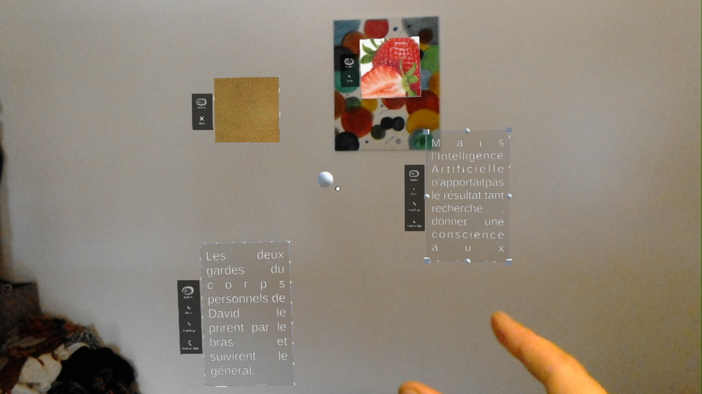
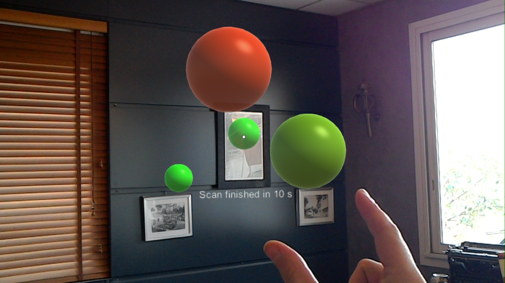
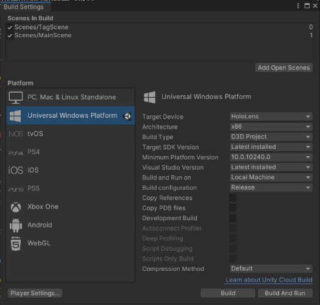

# Organization of the workspace in Augmented Reality - PFE

This project was realized within the scope of a "Projet de Fin d'Etude" (End of Study Project) at University of Bordeaux.

This software is a prototype of a document visualization application (images & text visualization) which proposes an automatic organization of its documents according to certain criteria (physical environment, object of interest...). The user is also allowed to manually modify this organization. It was implemented by using the Unity development platform and runs on the HoloLens augmented reality headset.

## Description

Our application currently supports two types of documents which are images files (JPG, JPEG & PNG) and text files (TXT). Each of the files is loaded from a folder of the application. Texts files are organized with a pagination system. For both types of documents, the level of detail evolves according to the distance to the user's head.

It is possible to anchor a file either in world space or in view space. View space anchored documents follow the user's head and are always visible on screen.  

For this prototype, we developed two main visualization methods opening different automatic organizations. The first one is based on tag areas. A user can place a zone object linked to a specific label, around which the documents are going to be automatically placed. 
The labels are retrieved from a local JSON setting file, linking each file with a tag. The second one is based on visualization heat maps. The more a place is looked at, the more it will gain interest. Documents are then automatically placed following the most interesting places.  

## Controls

The controls of this application are based on head movements and hand gestures. The cursor is positioned at the center of the field of view and can be moved by moving the head. It is then possible to interact by using hand gestures, which corresponds to an air tap. When the cursor moves from a dot to a ring, an interaction can be performed by doing an air tap.  

## Visuals

### Presentation Video

### Pictures

  |  
:-------------------------:|:-------------------------:
  |  

## Installation

This project was developed with the first generation of HoloLens in mind. So the following guide will only focus on this hardware. 

### Requirements

For the proper functioning of this project, it is essential to have completed the following steps:
1. Install Unity 2019.4.40f.
2. Install Microsoft Visual Studio 2019 16.11.23.
3. Install the Windows SDK, available [here](https://developer.microsoft.com/en-US/windows/downloads/windows-sdk/).
4. Verify that the MRTK 2.8.3 Foundation package is already included in the Packages folder. Otherwise, download it [here](https://github.com/Microsoft/MixedRealityToolkit-Unity/releases). Then, import this package in Unity, go to `Assets > Import Package > Custom Package` and select the MRTK package.

### Building in Unity

Open the project with Unity and go to `Assets > Build Settings > Universal Windows Platform`. When building the project, be sure that the parameters are the same as below. Also, make sure to put the different scenes in the build. The first scene (index 0) must be `TagScene` for branch main and `LaunchTimer` for branch heatmap. Then, the second scene (index 1) must be `MainScene`. 

Main branch            |  Heatmap branch
:-------------------------:|:-------------------------:
  |  

After that, click on the build button and select the destination folder where the project will be built.

### Deployment on HoloLens

The HoloLens must be setup for deployment, which means developer mode must be active. To do so, follow these instructions : 
1. Turn on your HoloLens and put on the device.
2. Use the flower gesture to display the main menu.
3. Select the `Settings` tile to launch the app in your environment.
4. Select the `Update` menu item.
5. Select the `For developers` menu item.
6. Enable Use developer features to deploy apps from Visual Studio to your HoloLens.

Then, on your computer, open the `.SLN` with Visual Studio. While deploying, the HoloLens must be turned on, connected to your local internet network. Then follow these steps :
1. Go to `Project > Properties > Debugging > Device name`.
2. Search for your HoloLens IP address and select it.
3. Click on apply and close the window.
4. In the toolbar at the top of the window, the mode must be on `Release`, `x86` and `Remote Machine`. 
5. Click on play and put your HoloLens on.

If you encounter any problem during the deployment, refer to the guide from the official [Microsoft website](https://learn.microsoft.com/en-us/windows/mixed-reality/develop/advanced-concepts/using-visual-studio?tabs=hl2).

## Contribution standards

This project is a prototype but is opened to any future contribution remaining in the main idea of the application.

Since this project was made with Unity, it uses C# as its scripting language. Thus, for any contribution, we will ask you to follow C# Coding Conventions recommended by Microsoft. 

Our strictest conventions are as follows :

* `Pascal case` for classes, records and structs.
* `Camel case` for private or internal variables. 
* Write only one statement or declaration per line.
* Use parentheses to make clauses in an expression apparent.
* Keep sections of code arranged without returns.
* Use four spaces when indenting.
* Do not use magic numbers (hard coded values).

More precision and information on these coding conventions can be found on the official [Microsoft website](https://learn.microsoft.com/en-us/dotnet/csharp/fundamentals/coding-style/coding-conventions). 

## Code of Conduct

Be respectful to other contributors and members of this project. No disrespectful comments regarding race, religious preference, sexual orientation, gender identity, military status or age will be tolerated. Any violation of the previously mentioned terms can result in being banned from any further contributing to this project. Please follow the contribution standards (above) when contributing, or your contribution may be rejected.

## Authors

This project was made by :
* Maxime Dumonteil (<maxime.pascal.dumonteil@gmail.com>)
* Loup Germon (<loup.germon@etu.u-bordeaux.fr>)
* Maxime Meyrat (<meyratmaxime@gmail.com>)
* Alex Pepi (<alex.pepi.info@gmail.com>)
